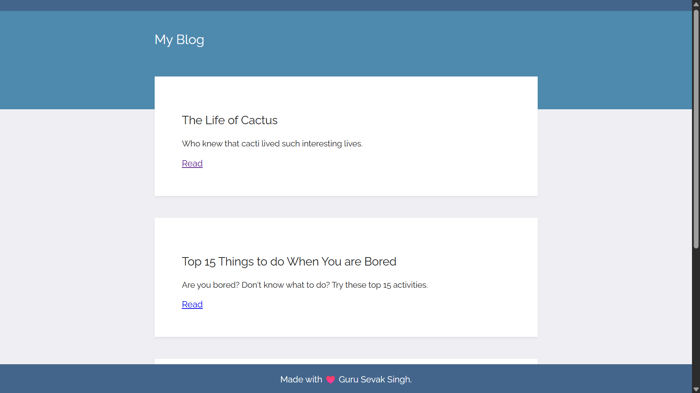
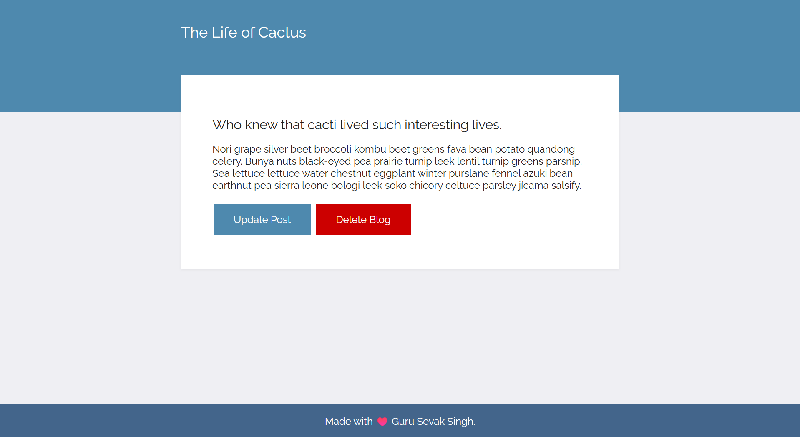
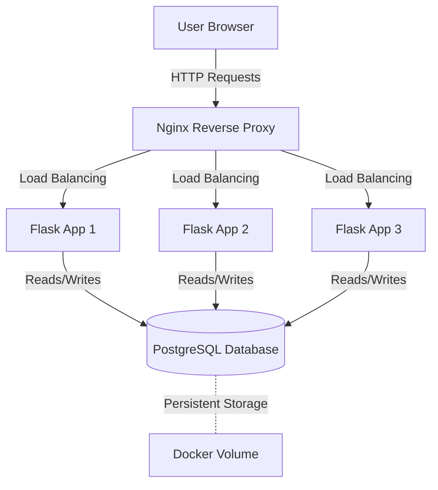

## 📝 Flask Blog App with Nginx & PostgreSQL

A production-ready blog application built with **Flask**, **PostgreSQL**, **Docker**, and **Nginx**.
This project demonstrates core CRUD functionality, Flask templating, containerized deployment, and reverse proxy setup with load balancing.
---

## 👨‍💻 My Role
- Designed and developed the entire **blog application** from scratch.
- Implemented **CRUD operations** (create, view, delete blog posts)
- Structured templates using **Flask Jinja2** base layout for reusability and clean design.
- Integrated **PostgreSQL** as the primary database for reliability and scalability.
    - **Nginx** (reverse proxy + load balancing)
    - **3 Flask application containers** (services running Gunicorn)
    - **PostgreSQL** (central database container with persistent storage)

- Configured Nginx to handle requests and distribute traffic across multiple Flask containers.
- Ensured modular, maintainable, and production-ready setup.
---

## 🛠 Skills & Tools Used
- **Python (Flask)** – backend & routing
- **PostgreSQL** – production-grade relational database
- **Gunicorn** – WSGI server for running Flask apps
- **Nginx** – reverse proxy & load balancer
- **Docker & Docker Compose** – containerization and orchestration
- **Jinja2** – templating engine for frontend
- **HTML/CSS** – basic UI styling
---

## 📸 App Screenshots

### Home Page – View Blogs

### Blog Detail With Add and Delete

---

## 🖼 Architecture Overview

