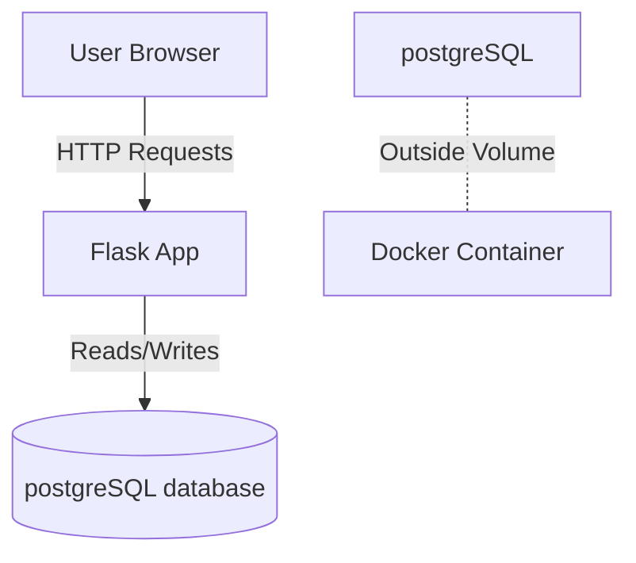

# 📝 Simple Flask Blog App

A minimal **blog application** built with **Flask** and **SQLite**.  
This project demonstrates core CRUD functionality, Flask templating, and Docker containerization with persistent storage.

---

## 👨‍💻 My Role
- Designed and developed the entire application from scratch.
- Implemented **CRUD operations** (create, view, delete blog posts).
- Built templates using **Flask Jinja2 base layout** for a clean structure.
- Use the **postgreSQL Database** so that it can be easy for production  usage.
- Containerized the app with **Docker**, keeping the **SQLite database outside the container** for persistence.
- Ensured simple, modular code for easy understanding and extension.

---

## 🛠 Skills & Tools Used
- **Python (Flask)** – backend & routing  
- **SQLite** – lightweight database  
- **Jinja2** – templating for UI
- **postgreSQL** - adding the postgreSQL database
- **Docker** – containerization with volume mount for external DB  
- **HTML/CSS** – basic UI styling  

---

## 📸 App Screenshots

### Home Page – View Blogs

### Blog Detail With Add and Delete

---

## 🖼 Architecture Overview

